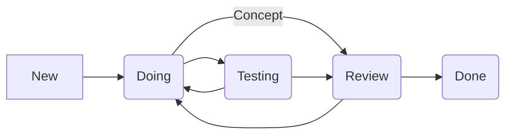
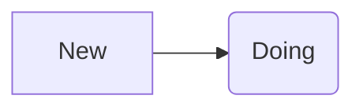
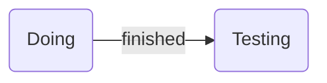
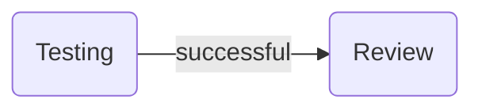
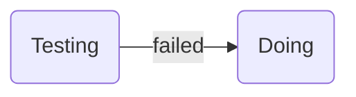
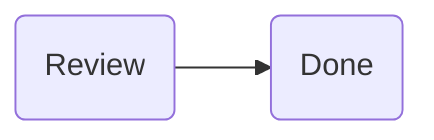
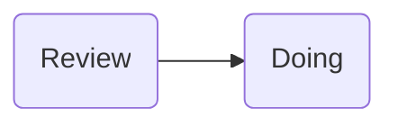

 Definition Of Done
==============================

Workflow
----------------------------

Statustransitions
----------------------

As soon as an Issue, a Story or a task is being worked on for the first time, the State of this Story, Issue or Task transitions from "New" into "Doing".

-----


As soon as work has been concluded on the Issue all existing code that has been written has to be tested.  Before a transition from the state "Doing" into "Testing" can be made following points should be considered:
  * Are the acceptance criteria met?
  * Is the code commented/documented?
	  * *Note: code has not to be fully documented by this point.*
  * Does the code run?
  * Styleguide criteria met?
  * Is all code pushed into the feature branch
  * Is the most recent Master version merged into the feature branch?
  * 
  
 Only if all points listed above are met a transition is to be made from "Doing" into "Testing"

 ---
 ```mermaid
graph LR
A(Doing) --Concept--> B(Review)
```
In case of a Concept Story a State transition from "Doing" to "Review" is to be done as soon as following requirements are met:
* Concept has been developed
* Concept has been documented and is ready to be presented

----


A transition from "Testing" into "Review" is done as soon as following criteria are met:
* System tests and API to cover acceptance criteria are created
* System tests for Frontend are done in 3 different Browsers and are successful (Google Chrome, Firefox, Safari)
* Successfully executed API tests for Backend
* Documentation should be finished by this point
* Code is sufficiently commented
* Merge request created
* Pipeline succeeds


If any of the Tests fail the Story/Issue transtions back into the state "Doing".  In this case all errors that occured during testing are to be fixed  before transitioning back into the state "Testing".

---


Before a transition from "Review" to "Done" following criteria have to be met:
* Review is done by 2 separate people unrelated to the Story/Issue
* Documentation & code comments are sufficient and complete
* Code passed Pipeline
* After approval merge into master branch and deployment of code to DevServer


If the Merge request fails to pass the review, the Story state transitions back into state "Doing" due to e.g. insufficient documentation. In this case issues found by reviewers are to be fixed and undergo a second review.

