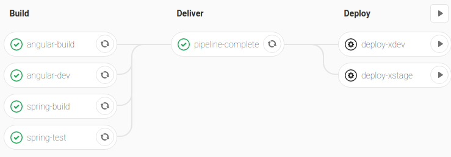

XSTAMPP 4.0 Admin Documentation
===============================

:house:[Home](README.md)

Content
-------
* [Admin Rights in XSTAMPP 4.0](#admin-rights-in-xstampp-40)
* [Server Administration](#server-administration)
    + [Logon to the server](#logon-to-the-server)
    + [Set Admin](#set-admin)
    + [Log Files](#log-files)
    + [Internal System Components](#internal-system-components)
    + [Set Themes and Corporate logo](#theme)

Admin Rights in XSTAMPP 4.0
------------
The following section briefly describes the rights and settings the role of the system admin is granted within the web application of XSTAMPP 4.0. For further roles please see the [role concept](role-concept.md).

#### User Administration
As system admin you have an overview of registered users with their chosen name and e-mail address. Furthermore you can set a users' password if the user forgot it or cannot login anymore.

#### Group Administration
In the system a user can participate in a group that shares projects. Every user can have a different role in ea group as descriped in [role concept](role-concept.md). The group leader can add and remove users as well as all the project created in this group. In case the group leader leaves the group, the system admin can set a new group leader using the web tool.

#### Theme
As system admin you have the acces to the section 'corporate theme'. In this section you are able to determine colors for the web site(for example the color of the buttons used). You are also able to upload a Corporate Logo at this specific section. 

Server Administration
---------------------

#### Logon to the server
* Get SSH access to the server.
* Logon for example with [Git Bash for Windows](https://gitforwindows.org/) and `ssh username@server`

#### Set Admin

The system admin is set via direct access to the database. Use `docker exec -it xstampp4_ext-postgresql_1 psql -U postgres xstampp-master` in order to access the postgres console.
* `exec`    execute program in container
* `it`      interactive terminal
* `xstampp4_ext-postgresql_1` name of the program
* `psql` is command line client of postgres
* `-U` postgres takes master user
* `xstampp-master` is user data database, `xstampp-project` contains the project data instead

_Info: There can be multiple system admins._

Use the following command to make a user an admin in the database. The rights will be granted specificly for one mail address.  
`xstampp-master=# UPDATE public.user SET is_system_admin=true where email_address = 'admin@admin';`

Use the following command to list the email addresses of users that are admins.  
`xstampp-master=# SELECT email_address from public.user WHERE is_system_admin=true;`

#### Log Files
Login to the desired server with a user that has a permission to use docker (see https://docs.docker.com/install/linux/linux-postinstall/)

In order to view one containter's log file use `docker logs NAME`  
To see live update use 
`docker logs -f NAME`  
To filter use
`docker logs NAME | grep XX`

#### Docker Compose
Docker Compose is used to easily restart and stop the several containers used for the project.
To access docker compose, navigate to the path where the .yml or .yaml file is located. Use `docker-compose` with one of the following commands:
* `up`: to create and run applications configured in the file; use `-d`for detach, the containers will not be started within the console and thus stay even though the console might get closed
* `stop`: to stop the currently running docker containers
* `rm`: to remove the docker containers

Server Deployment
------------------------------------

#### via GitLab-Pipeline

A server deployment from master can be executed via the GitLab CI/CD-Pipeline. A manual trigger is needed to initiate the deploy stage of the pipeline. You can choose which development server you want to target.

When you initiate a deployment process, an additional confirmation `YES` is needed in the corresponding job console.

#### See Also
 * [deployment scripts location](repository-folder-structure.md#deploy)
 * [server launcher](server-launcher.md)

