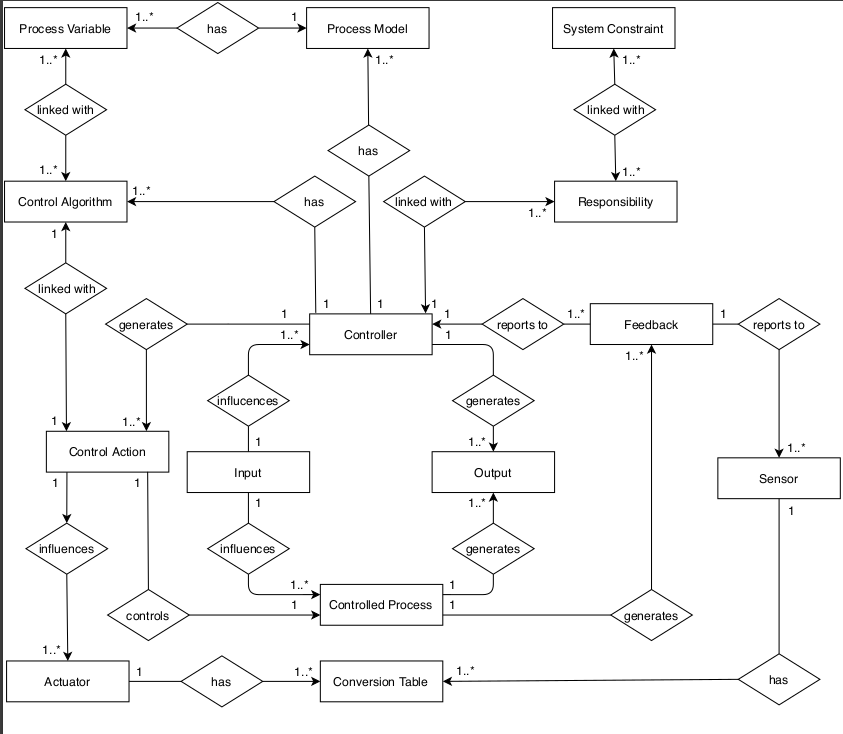
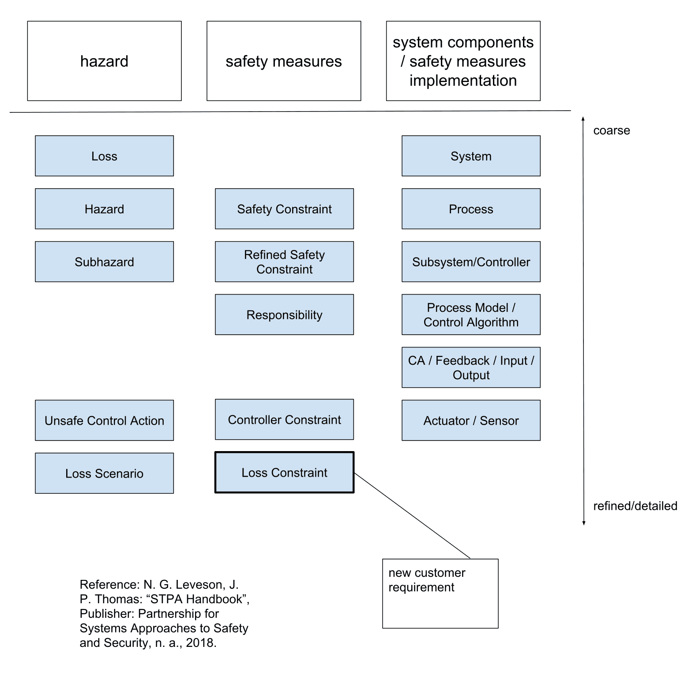
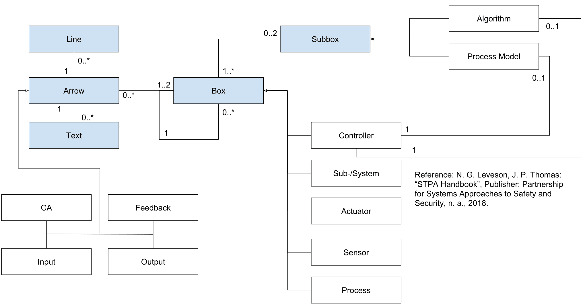

XSTAMPP 4.0 Appendix
=============================

Links
-----
* [Home](README.md)

Figure 1: Entity types of the STPA process and their relationships

Figure 2: Entity types grouped in categories

Figure 3: Data model proposal for the control structure

