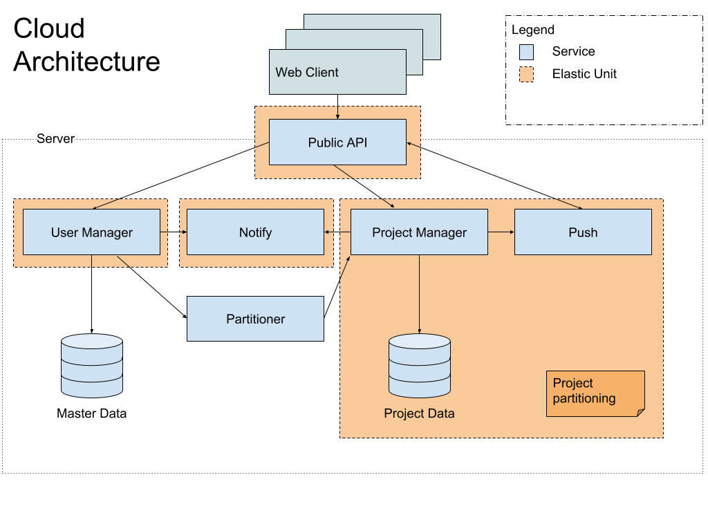
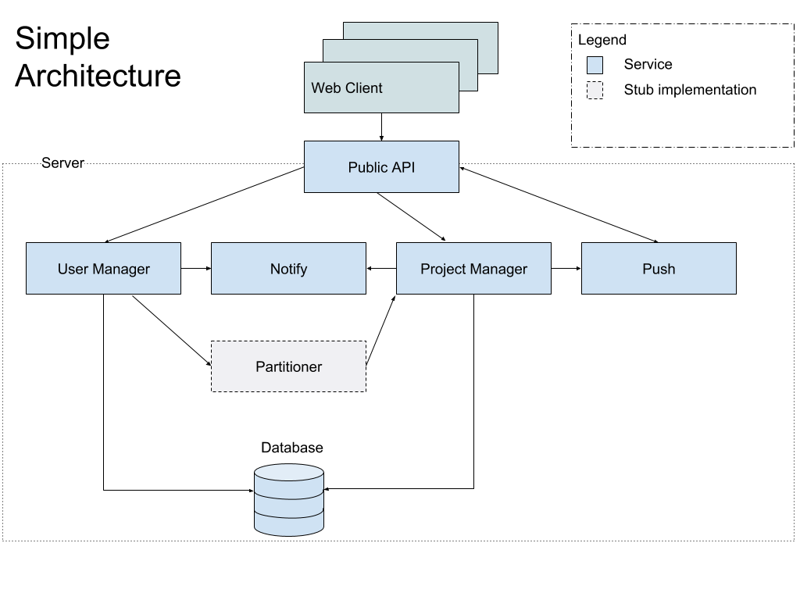

XSTAMPP 4.0 Architecture Description
====================================

:house:[Home](README.md)

Content
-------
* [System Goal](#system-goal)
* [Architecture Diagrams](#architecture-diagrams)
* [Architecture Description](#architecture-description)
    + [Simple Architecture](#simple-architecture)
    + [Cloud Architecture](#cloud-architecture)
* [Service Descriptions](#service-descriptions)
    + [Web Client](#web-client)
    + [Public API](#public-api)
    + [User Manager](#user-manager)
    + [Project Manager](#project-manager)
    + [Notify](#notify)
    + [Push Service](#push-service)
    + [Partitioner](#partitioner)
* [Communication](#communication)
    + [API Calls](#api-calls)
    + [Realtime Updates](#real-time-updates)
* [Locking (separate document)](locking.md)
* [Technologies (separate document)](technologies.md)
* [Persistence Layer (separate document)](persistence-layer.md)
* [Domain Model (separate document)](domain-model.md)

System Goal
-----------
The system goal is to provide a tool for STPA analysis. Cooperative functionalities improve work on large analysis in teams. Furthermore, this is a platform for future extensions to add more analysis functionalities and other analysis processes.
A modern frontend provides an intuitive approach to perform a STPA analysis. This helps to easily understand the several analysis steps and the overall process. 

Architecture Diagams
--------------------

Figure 1: Cloud Architecture as extended approach for the simple architecture

Figure 2: The simple approach which will be realized within this EnPro 

Architecture Description
------------------------
This project runs for six months and a large set of functionalities have to be implemented. Therefore, we chose a ‘simple’ Architecture to save time for implementing the basic system with the core functions. We also have a single VM for the operation of the whole system. This does not allow a fully scalable application. In case the ‘simple’ architecture does not fit the workload some days we designed an iterative architecture approach with two steps.

We have two planed architectures which fits for the system in general. In this project we will realize the ‘Simple Architecture’ which fits for a smaller load of concurrent user. The ‘Cloud Architecture’ is designed to be the next step of the ‘Simple Architecture’. So we can extend this architecture to archive more performance if many projects and users are working on the system. The two approaches will described in the following chapters.

### Simple Architecture
The Simple Architecture was created to be easy and quick to run and maintain. The set of running Services is fixed. This architecture is not be scaled horizontally and should be extended to the second ‘Could’-step if the number of users and projects increases. 

### Cloud Architecture
The Cloud Architecture was created with elasticity and performance in mind. Particular care was taken to allow horizontal scaling. The Elastic Units (orange in the diagram) each can be independently horizontally scaled. The for the system can handle a dynamic load.

Service Descriptions
--------------------
### Web Client
The Web Client is a Rich Client which provides a user interface to make a STPA analysis. This Client is delivered over the Public API and runs in the clients web browser.

### Public API
This API is a Gateway for all functions of this application. It works like a proxy and provides a general endpoint for all kind of requests. Then it redirects all request to the intended destination.

### User Manager
The User Manager administrate all users with their permission in the system. It also handles all login logic (e.g. token generation). See Login for further information.
It maintains the authoritative list of projects as well as the project-specific roles for all users.

### Project Manager
The Project Manager handles all project data. It provides functions for get project data and alter existing information. All project specific operations will be implemented and provided in this service.

### Notify
The notification service provides functions to send E-mail notifications to users. There should be a function to subscribe for a project change. In that case this service gives the possibility to send mails from the system to each user.

### Push service
The Push service provides a public-subscribe-model for the client to get notified in real time, if some changes made on certain data. This allows the client to refresh the showed data in case the data has changed while watching it.

### Partitioner
Only exists in the cloud-specific architecture. The Elastic Unit of Project Manager and Push-Service is a elastic unit that is scaled out by partitioning the projects. Therefore, the partitioner is responsible for selecting overutilized instances, partition the projects, start a new instance and move the selected project data to the new instance.

In case of scale in the instances it is also responsible of merge the project data from two instances.

In case only the ‘Simple Architecture’ is used, the Partitoner is not needed with the full set of functions. Only the orchestration of deleting and creating projects is needed, scaling doesn't need to be implemented. This is why it is highlighted as a stub implementation in the diagram.

Communication
-------------
This section describes the communication between the services. The first is the API which is provided over the public api. Also the communication for update subscription will be described below.

### API calls
The general API is designed as a REST interface. 
This public interface is not restricted to the provided frontend implemented in this project. This gives the possibilities to extend the toolset for STPA analysis with additional tools which uses the open api. 

For the internal communication over Rest a shared lib will provide marshalling and unmarshalling functions and DTOs for a shared data model.

### Real-time updates
For cooperative working, it's necessary to inform other users which are working on the same set of data. Therefore, clients are able to subscribe for changes. If a client changes  a date others who are subscribed will be informed which entry was changed. The other clients can now actively request the whole entry to update their local cached data if this is needed. This gives the freedom that clients which are subscribed but do not need the updated data won’t request the new data from the server.

This will be archived by giving the opportunity to open a websocket for a specific topic. The push service will handle this functionality. The Push service will be triggered by the project manager if some changed were made and push a information will be sent to all listening clients.

Future Implementations
-------------
This sections is to show the intended way for extend the current archtecture for new features.

### Import/Export
The import and export are used to port projects from and to the old xstampp 3.0. 
Currently, the old XSTAMPP 3.0 uses an XML schema for saving project data. 
Therefore, a mapper is needed to import the xml and set the right values for the database. 
As export a xml file should be generated with all desiered data.

Importing and Exporting has no direct dependencies to other system functions. 
The amount of work is also more or less a bulk operation. 
Therefore, a new backend service should be created to archieve that. 
This component shoud provide additional apis to import and export a full project. 
This can be executed asynchronously.

### Generate Report
The report generation is a workintensive process in which all needed information are used to export a human readable document.
This is most likely a PDF document.
Therefore, a new component is needed to create a PDF document with a job specific configuration.
This task can take some time so the execution should be asynchronously.

Via the UI it should be possible to make a configuration and request a report. 
This triggers the report component which generates a report.
Via the push or notify service a share link can be provided to get the file.
After some time the generated file will be deleted.
Another option is to send the report via mail over the notify servie. 
This depends on the report size. 