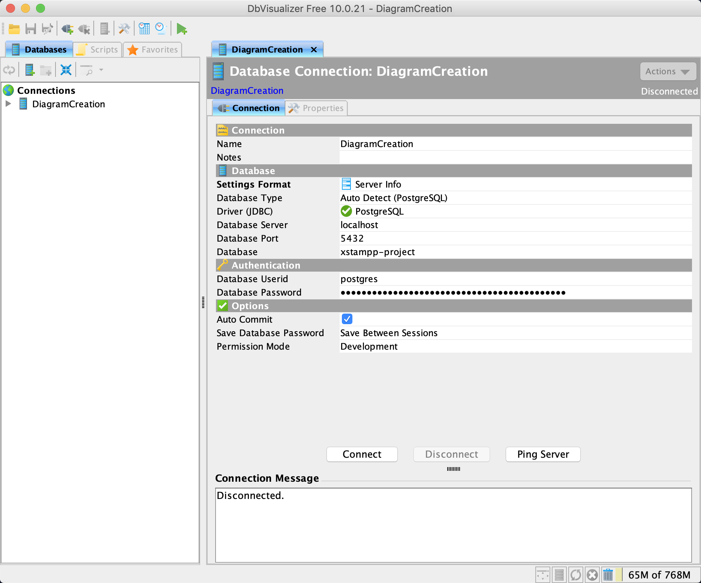
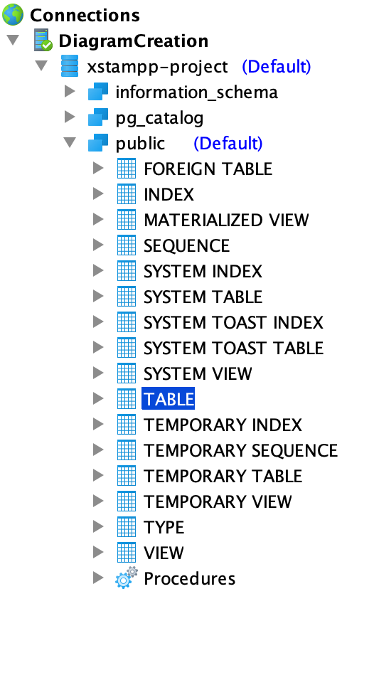

XSTAMPP 4.0 Creating an Entity Relationship diagram
=================

Links
-----
* [🏠Home](README.md)
* [Master ER-diagram](model-er-master.md)
* [Project ER-diagram](model-er-project.md)

Introduction
-----
Entity Relationship diagrams provide a nice overview of the architecture of your database.
Check the links above for examples.

Instructions
-----
### 1. Install DbVisualizer
Download and install DbVisualizer from [this](https://www.dbvis.com/download/) site.

### 2. Expose the PostgreSQL port
Open up *xstampp-4.0/xstampp-deploy/docker/docker-compose.yaml* and modify it, so that PostgreSQL
is accessible from outside the container:
<pre>
  ext-postgresql:
    image: postgres:11
    ===INSERT=THIS===
    ports:
    - 5432:5432
    =================
    networks:
    - xstampp4
    volumes:
    - ../../xstampp-data:/var/lib/postgresql/data
    - ../../xstampp-deploy/sql/postgres-initdb.d:/docker-entrypoint-initdb.d
    env_file: ../../xstampp-config/postgresql/pw.env
    restart: unless-stopped
</pre>

### 3. Run the Backend
Re-run it if it was already running.

### 4. Retrieve a database password
When you run the Backend for the first time, new passwords get generated. Open up
*xstampp-4.0/xstampp-config/postgresql/pw.env*, pick one and copy the string of
characters after the `=`.

`POSTGRES_PASSWORD=[password]` is the password for the username "postgres"  
`PG_XSTAMPP_PASSWORD=[password]` is the password for the username "xstampp"  
Either one will do.

### 5. Open up DbVisualizer and establish a connection like this:

* **Database** is the name of the database you want to create a diagram out of. Can be 
  `xstampp-master` or `xstampp-project` or something else.
* **Database Password** is the password you copied in the last step.
* **Database Userid** is the corresponding username, depending on which password you picked.

Click "Connect" when you are done

### 6. Navigate through the database
You most likely want the TABLE entry in "public". Doubleclick it to open it.

### 7. Generate the diagram
Open the "References" tab in the upcoming view. It might take a while for the program to
load and arrange all entities.

### 8. Export the diagram
Use the toolbar at the top to zoom in until you can read even the small text clearly.
This is important because the resolution of the exported image is dependent on the zoom factor.
Then you can use the export button to export the diagram as an image.
