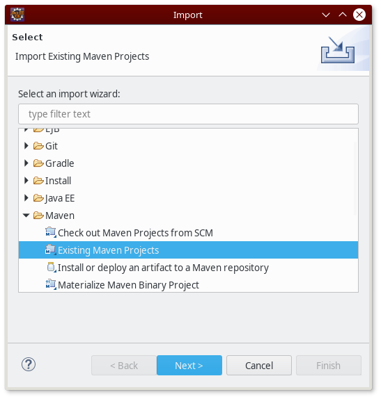
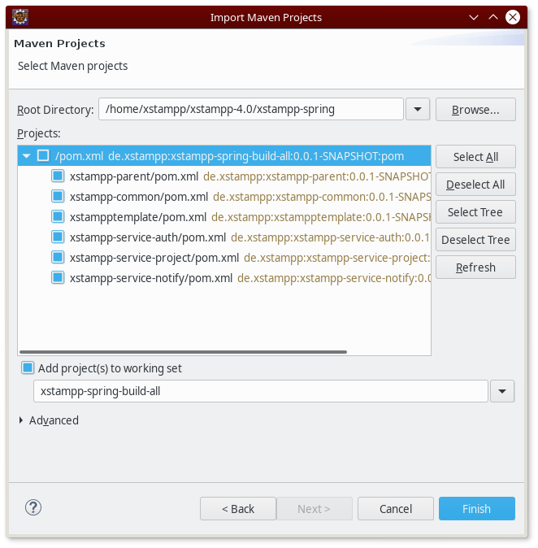
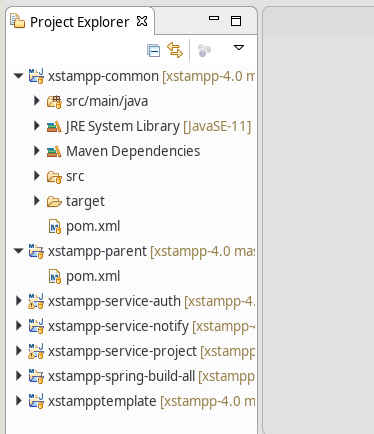
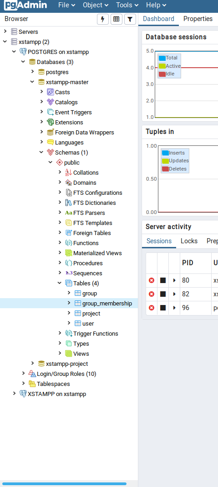
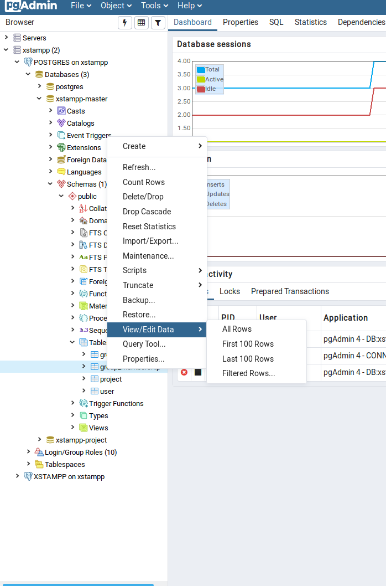
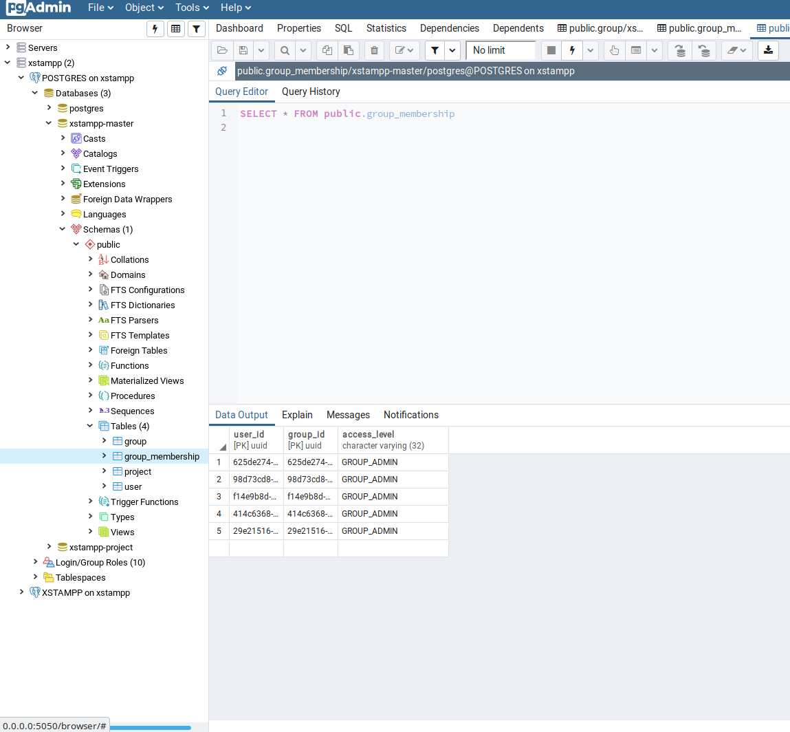

XSTAMPP 4.0 Developer Setup
===========================

:house:[Home](README.md)

Content
-------
- [XSTAMPP 4.0 Developer Setup](#xstampp-40-developer-setup)
  - [Content](#content)
  - [Check out repository](#check-out-repository)
  - [Download required software](#download-required-software)
    - [Backend](#backend)
    - [Frontend](#frontend)
  - [Configuring the IDE](#configuring-the-ide)
    - [Configuration for Backend](#eclipse-configuration)
      - [Eclipse](#eclipse-configuration)
      - [IntelliJ Remote Debugging](#intellij-backend)
    - [Configuration for Frontend](#configuration-for-frontend)
      - [Git with Webstorm](#git-with-webstorm)
  - [pgAdmin4](#pgadmin4)

Check out repository
--------------------
* Get repository access
* Add SSH key (generate with `ssh-keygen`, upload to repository settings)
* Clone the repository to your machine (with `git clone`) 

Download required software
--------------------------
### Backend
* Java 11 is required to build 
  * Either obtain Java 11 from a distribution of your choice ...
  * ... or download OpenJDK 11 from https://jdk.java.net/11 and extract it to a temporary directory
* Eclipse 2018-12 for Java EE developers https://eclipse.org/eclipseide/ (Important: this version supports Java 11)

### Frontend
* node.js 10 LTS from https://nodejs.org/en/
* Webstorm from https://www.jetbrains.com/webstorm/download/#section=windows (student license needed)
* Development is also possible with Visual Studio Code https://code.visualstudio.com/ and Angular plugin https://medium.com/frontend-coach/7-must-have-visual-studio-code-extensions-for-angular-af9c476147fd

Configuring the IDE
-------------------
### Eclipse Configuration

First, set up the eclipse workspace.
* If OS reports missing JRE or JDK while installing Eclipse use path from downloaded JDK.
* Launch eclipse 2018-12
* When asked to select a workspace, create a new workspace directory for XSTAMPP. It is best not to re-use an existing workspace to avoid configuration conflicts.
* Add your Java 11 installation to eclipse
  * Open the preferences via [Window] → [Preferences]
  * Navigate to [Java] → [Installed JREs]
  * If Java 11 isn't already present, Click [Add...]
  * Select "Standard VM" and hit [Next >]
  * Click the [Directory...] button to select the directory that you extracted Java 11 to
  * Hit [Finish]
  * Hit [Apply and Close]

Then, import the XSTAMPP 4.0 projects.  
_NOTE: Do **not** use "Check out Maven projects from SCM" or any option other than "Existing Maven Projects". This will result in an incorrect Eclipse project configuration and Eclipse won't be able to compile the software._

* Open the import vizard via [File] → [Import...]

  

* Select "Existing Maven Projects" under the "Maven" folder
* Click [Next]
* In the Import Maven Projects wizard, click [Browse...] to select the root directory
* Select the "xstampp-spring" subfolder of the repository clone.

  

* Make sure all the `de.xstampp` Maven projects are selected as shown in the screenshot
* Hit [Finish]
* Eclipse will now import and build all projects. This may take a short while.
* When opening a Java project such as xstampp-common in the project explorer, you should see "JavaSE-11" as the selected JRE System Library.

  

### IntelliJ Remote Debugging of Backend Services

This guide assumes that you have opened xstampp-4.0/xstampp-spring in IntelliJ.  Run Configurations are stored in xstampp-4.0/xstampp-spring/.idea/runConfigurations. They are under version control and you received them by pulling from master.

Only one service can be debugged at a time.  
**Hint: Avoid method breakpoints, break on the first line of the method instead**  
This avoid slow down of the service, which might make the frontend seem unresponsive.
If you aren't afraid of a slow running app you can create method breakpoints.
<h4> Debugging of a service </h4>

1. Set breakpoints in one service.

2. Select **"XSTAMPP DEBUG *service-name*"** run configuration where service-name is the service you set breakpoints in.

3. Click the green bug symbol to start debugging. The docker instances should be created and the console should show **"Connected to the target VM, address: 'localhost:5005', transport: 'socket'**. You might have to click the green bug symbol again if you do not end up in debug mode after some time.

<h4>Making changes to code</h4>
If you make changes to code of the service that is being debugged your code is now out of sync with the jars deployed in the containers.

Case 1: Changes to code of the service that is being debugged  
1.  Goto Menu -> Build -> Build Module 'xstampp-service-*service-name*'  
2.  Upon completion of build IntelliJ is going to altert you to the fact that classes have changed and asks you whether you want to reload them.
This works via HotSwap offered by the debugging mechanism running the jar within the container.

Case 2: Changes to code of other services

Make the change and get the runnable jar built by running mvn package.
This might be done from within IntelliJ. When the new jar exists restart the docker container running the respective service.

<h4>Switching the debugged service</h4>

1. Stop all docker containers pertaining to xstampp. You can do this from within IntelliJ
2. Follow *Debugging of a service* for the service of interest.

<h4>Troubleshooting</h4>

1. Down all xstampp containers
2. Start the debug configuration of choice

### Configuration for Frontend
* Install Node.js 10.15.3 LTS
* Install Webstorm

open the root dir of the project 
(where the `package.json` is)

run:
- `npm i -g @angular/cli`  (installs angular globaly)
- `npm i` (installs dependecies)

to start:
- `npm start` or `ng serve --aot --open` or `ng serve --open`

Sometimes npm doesn't install the types for the backbone library  
if you get a backbone error  

run:
- `npm i @types/backbone`

#### Git with Webstorm
_Note: Especially for merge (conflicts) the webstorm UI is really helpful._

pgAdmin4
-------------------

<h4>What and How?</h4>

In our project, pgAdmin4 runs inside its own docker container. Use a webbrowser to access the tool's GUI. pgAdmin 4 provides dialogs that allow you to modify all table properties and attributes. Additionally pgAdmin 4 provides dialogs that you can use to design and create database objects such as views, triggers, etc. Find its documentation at https://www.pgadmin.org/docs/pgadmin4/dev/index.html.  
On our project it is run as docker container and accessed via the webbrowser.

<h4>Starting pgAdmin4</h4>

Go into *xstampp-4.0/xstampp-deploy/docker*.

**Variant 1: Starting services and pgAdmin4 at once** 

`docker-compose  -f docker-compose.yaml -f optional-pgadmin.yaml up`

**Variant 2: Starting pgAdmin4 after starting services**

1. Start services: `docker-compose up`  
2. Start pgAdmin: `docker-compose  -f docker-compose.yaml -f optional-pgadmin.yaml up --no-recreate`

<h4>Stopping pgAdmin4</h4>

**Variant 1: Stopping services and pgAdmin4 at once**  

`docker-compose -f docker-compose.yaml -f optional-pgadmin.yaml down`

**Variant 2: Stopping only pgAdmin4 and leave services running** 

`docker stop pgadmin_container`

<h4>Connecting to pgAdmin4 via web interface</h4>

You connect to pgAdmin by entering "http://0.0.0.0:5050" into your address bar.  
**[- Connecting to "http://localhost:5050" doesn't work. -]**

The credentials are configurable in *xstampp-4.0/xstampp-deploy/docker/optional-pgadmin.yaml*. By default they are:  
Email Address: **pgadmin4@pgadmin.org**  
Password: **admin**

The docker container is preconfigured to connect to the postgres server by mounting the *xstampp-4.0/xstampp-deploy/docker/pgadmin-config/servers.json* into it. 
There are two connections to the same server. One as user 'xstampp' another one as user 'postgres' which is the root user.
servers.json is not in *xstampp4.0/xstampp-config* because one would have to change the *xstampp-4.0/xstampp-deploy/launch/start-server* script which is beyond my abilities.

The first time you connect to the postgres server you will be prompted for passwords. You can lookup these passwords in *xstampp-4.0/xstampp-config/postgresql/pw.env*. 
The file will only be there if you have executed the launch-server script beforehand.
Be sure to save the passwords. Thus you won't be prompted for them even after restarting the container.

<h4>Viewing a table's rows</h4>

Viewing a tables rows is a basic but useful functionality of pgadmin.
To access the contents of the group_membership table inside the xstampp-master database for example:

**1. Expand sidebar as shown.**

**2. Right click the group_membership entry to get a menu. Select how many rows you want to see via View/Edit Data.**

**3. View the results**

