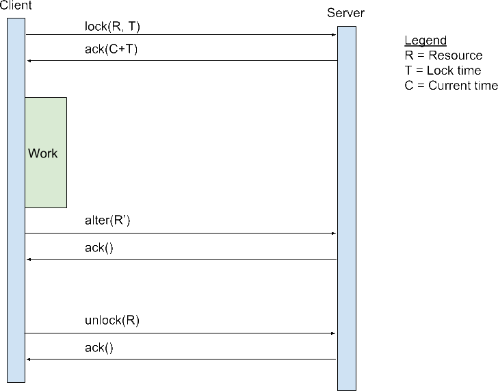
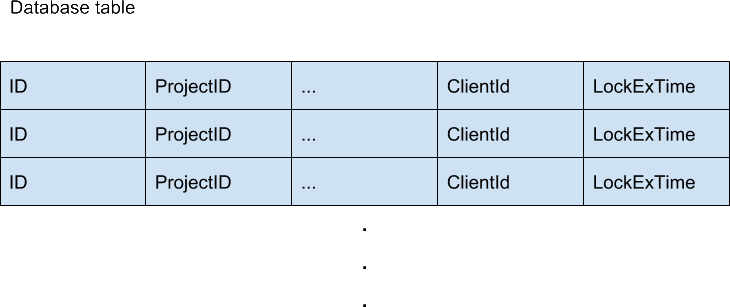

XSTAMPP 4.0 Locking
===================

Links
-----
* :house:[Home](README.md)
* [Architecture Description](architecture-description.md)

Content
-------
* [Locking](#locking)
    + [Lock Process](#lock-process)

Locking
-------

Figure 3: Sequence diagram for the whole locking process

The locking concept is based on the optimistic locking principle in which it is possible to read data while its locked. This allows to show ‘old’ data to other clients while one is currently editing it. This is acceptable because the ‘old’ data is valid until the edit is complete. So read operations are always allowed.

The lock will be achieved as fine granulated as possible. Therefore, if possible each database entry has a additional client_id and lock_exp_time. If a lock will be made by a client its id (generated by login) is set as new client_id and the timestamp till the lock expires is set as lock_exp_time. This can be seen in figure 4.

In general the locking is designed to be as open as possible to prevent errors on edit operations which are avoidable. This leads to the disadvantage that an non-executable operation will fail during the actual execution and cannot determined before. We decided to accept this disadvantage, because we assume much more read operations as write operations. In the normal workflow it is also assumed that only one or only a few people are working (and thus edit data) on a set of data. Therefore, theoretically only a few conflicts will appear at all.

### Lock process
The general approach is displayed in figure 3 which shows a sequence diagram for the lock process in general. A more detailed description is below.

To lock a resource, the client has to lock a resource by make a lock request with the resource id and the time for how long the resource will be locked. The time which is possible should be selected by the client, because it’s important how the changes are made in the client to decide how long the edit process takes. The server response with either an error if the resource is not available or already locked or a success message with the absolute timestamp when the lock expires.

Now the client can start with the edit process and let the user start working on the set of data. If the lock will expire soon the client is able to extend an existing lock and ‘add’ more time to it. This will be made with an additional lock request on the already locked resource with the new amount of time which will be added.

After the work is done the clients sends a altering request to the server to change the data. In this case several scenarios can happen. If the change will happen before the lock expires everything will work smooth. If the lock is expired two things can happen. The first is the client id is still the same as it was set in the set lock action. In this case no other client has locked the entry and so it’s still possible to alter the data unscrupulously. The second scenario is that the client id doesn’t match with the own. This indicates that another client has now this lock and a edit operation on the desired data is illegal at all. In this case, the altering fails and an error will be returned to the client. So following error handling is specific for the requested data and has to be handled there.
If the edit is finished or the lock is no longer needed (e.g. cancel the edit) the client should call a unlock to disable the current lock and opens the resource for other clients to lock and edit.

Figure 4: Database entries with lock fields

