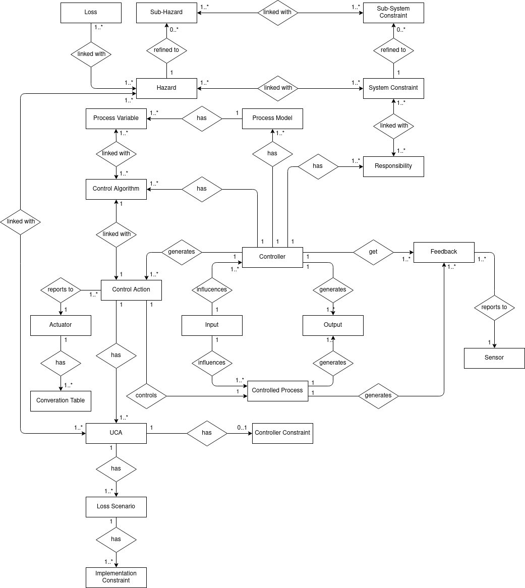

XSTAMPP 4.0 Domain Model
========================

Links
-----
* :house:[Home](README.md)
* [Architecture Description](architecture-description.md)

Domain Model
------------

In the following we show the two domain models of our system. These models were created based on the [STPA Handbook](https://psas.scripts.mit.edu/home/get_file.php?name=STPA_handbook.pdf) by Nancy G. Leveson and John P. Thomas.
The relations between the objects are based on the explicitly shown relations in the examples and the implicitly described relations in the second chapter.
The first of the following models shows the relations and interactions between the entities whose relations are solely shown through the tables.
In the second model we describe the relations between the control-structure entities whose relations are shown through the control-structure in step 2 and 4.

__Domain model control-structure__

In the second model we describe the relations between the control-structure entities whose relations are shown through the control-structure in step 2 and 4. Note that the aggregate entity's linking to output and input
are interchangable with the singular entity's in the model. This means for instance that an input could have a link to one or more actuators and/or one or more controled processes.

