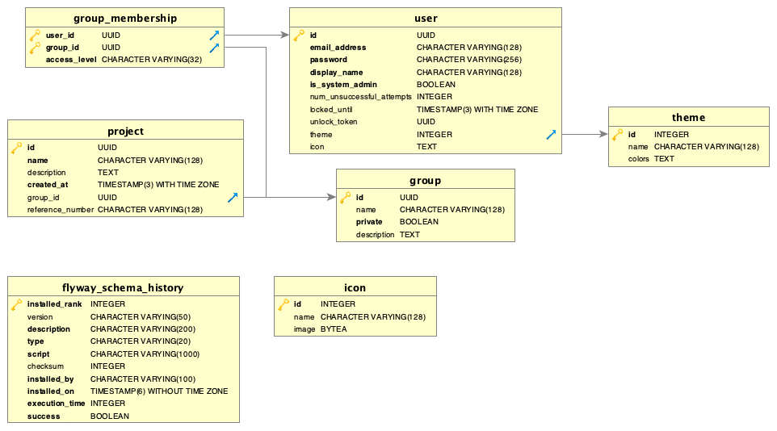

XSTAMPP 4.0 Entity Relationship diagram for the master diagram
========================

Links
-----
* :house:[Home](README.md)
* [Architecture Description](architecture-description.md)

Entity Relationship Diagram Master
----------------------------------

The following diagram shows the relationships between the entities of the user database. Important to note is that every project entity must have a corresponding entity in the project database with the same UUID.

[How to create this diagram](creatingErDiagrams.md)
