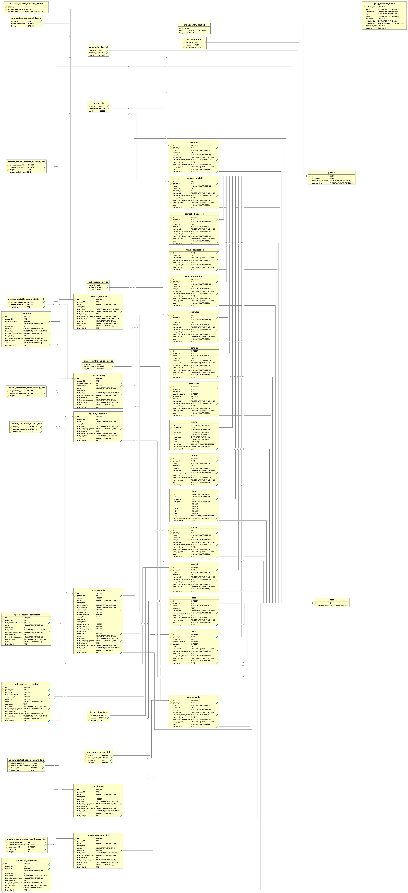

XSTAMPP 4.0 Entity Relationship diagram for the master database
========================

Links
-----
* :house:[Home](README.md)
* [Architecture Description](architecture-description.md)

Entity Relationship Diagram Project
----------------------------------

The following diagram shows the relationships between the entities of the project database. As can be seen, every entity in the project database, with the exception of a project entity, must be referencing a project entity to uniquely identify it. As such th project_id is a part of every ForeignKey in the model.

Important to note is that every project entity must have a corresponding entity in the master database with the same UUID.

[How to create this diagram](creatingErDiagrams.md)
