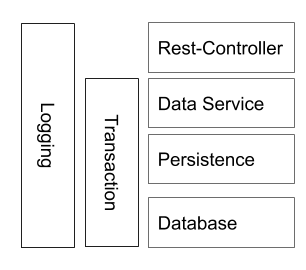
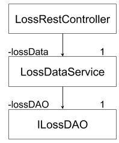
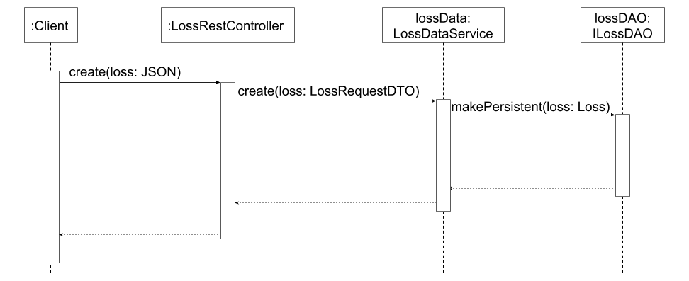
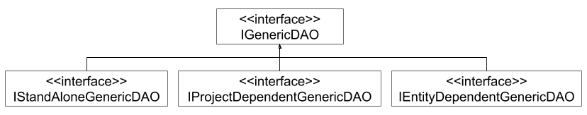

XSTAMPP 4.0 Persistence Layer
=============================

Links
-----
* [Home](README.md)
* [Architecture Description](architecture-description.md)

Content
-----
* [Role in the Application ](#role-in-the-application)
* [Description](#description-of-the-persistence-layer)
* [Solutions for the known Issues](#solutions-for-the-known-issues)
* [Outlook](#outlook)

Role in the Application
-----
As described in the chapter Architecture Description there are several services. This chapter describes the structure of one service on the example of the Project Manager service.

The Project Manager service is structured in layers. The following diagram illustrates the layers.

Figure 1: Structure of the Project Manager service

The authentication component is omitted for simplicity reasons. Its functionality is described in the chapter [Login Process](login-process.md).

The layer Rest-Controller defines rest interfaces, communicates with the client, authorize client requests, converts and transports error messages to the client.

The layer Data Service validates incoming data, implements business logic and converts data in appropriate format for the database.

The Persistence layer communicates with the database, performs CRUD-operations (Create, Read, Update and Delete) on persistent data, generates identifiers and implements the pagination feature.

The database system is not part of the Project Manager service. It is a stand alone application and is illustrated only for completeness.

Transaction management is cross-cutting functionality. It provides transactional context to manage the concurrent data access and modification. The transaction management is implemented as session per request pattern. This patterns ensures data persistence for each successful request and provides the possibility for scalability and resilience of the Project Manager service.

Logging is also cross-cutting functionality. It provides the possibility for monitoring and troubleshooting of the running application.

Each of the three layers of the Project Manager is implemented as set of classes with one entry point class for each entity type and additional resources like configuration and libraries. The following diagram illustrates the entry point classes of each layer for the entity type Loss.

Figure 2: Example for the layers of the Project Manager service

The class instances of the different layers are interconnected to make data exchange between layers possible. The class instance LossRestController holds a reference to the class instance LossDataService and can call its methods. The reference is called lossData. The instance lossData holds a reference lossDAO of the type ILossDAO and can call its methods. The type ILossDAO is an interface and stands for the data access object which operates on the persistent data of the entity type Loss.

The next diagram illustrates a simplified example for the data exchange between the three layers of the Project Manager service.

Figure 3: Data exchange between application layers

In the first step a client calls the method `create(loss: JSON)` of the class instance LossRestController to send data as a JSON object. The class instance LossRestController unmarshalls the data and calls the method `create(loss: LossRequestDTO)` of the instance lossData passing the data as argument. The instance lossData validates the data and transforms it to the format which is appropriate for the database. In the next step the instance lossData calls the method `makePersistent(loss: Loss)` of the instance lossDAO and passes the data as argument. The instance lossDAO stores the data in the database. A response is returned to the client.

Description of the Persistence Layer
-----

The main purpose of the persistence layer is to provide operations on the persistent data in the form of Java methods. The persistence layer consists of the set of classes with one entry point class for each entity type and additional resources like configuration and libraries. To store data for the entity type Loss the persistence layer contains an instance of the type ILossDAO and an object of the type Loss. The instance of the type ILossDAO is a singleton which implements methods to access and store data in the database. The object of the type Loss represents the entity type of the same name. It contains e.g. the attributes name, description and id. The object is used to exchange data between the application and the database.

All entity types which are relevant for the STPA process are illustrated in the domain models ([Domain models](model-domain.md)) and additionally in diagrams in the appendix. The Project Manager service manages data of the entity types mentioned in the chapter [Project entity-relationship model](model-er-project.md). The entity type Project represents the analysed system. The other entities depend on the entity Project. Some entities depend on other entities e.g. each entity of the type SubHazard depends on an entity of the type Hazard.

The logic of the persistence layer is implemented with the data access object pattern. The structure of the generic data access objects reflects the hierarchical structure of the entities described in the previous paragraph. The following diagram illustrates simplified this structure.

Figure 4: Structure of the data access objects

The interface IGenericDAO provides methods for database operations on a single entity e.g. the create operation. The following interfaces inherit from this interface. The interface IStandAloneGenericDAO provides methods for retrieving several stand-alone entities e.g. entities of the type Project (in the User Manager service). The interface IProjectDependentGenericDAO provides methods for retrieving several project dependent entities like entities of the type Loss. Therefore the instance ILossDAO inherits from this interface. The interface IEntityDependentGenericDAO provides methods for retrieving several entities which depend on another entity like entities of the type SubHazard. Each data access object for an entity type implements at least one of the generic interfaces.

There are several data access objects like IControlStructureDAO and ILastIdDAO which do not fit into the described structure and therefore do not implement any of the generic interfaces.

The persistence layer is implemented using the ORM framework Hibernate. The Hibernate framework is integrated into the application using the Spring framework. The Spring framework also provides the transaction management. For more details about configuration refer to the class `de.xstampp.service.project.configuration.PersistenceHibernateConfiguration`.

Solutions for the known issues
-----

* Adjust the precision of the timestamps in the application to the precision of the timestamps in the database
* Introduce consistent logging
* Extract common code basis for the Persistence layer from the services Project Manager and User Manager

Outlook
-----

It was team decision to use a relational database for the Project Manager service. The reasons for that decision were available know-how in the team, better community support for the open-source relational databases and others. Nevertheless the object-oriented database type should be taken into account. It provides the best performance, because it can better handle the recursive structure of the control structure and a large amount of relationships between entities (see appendix). The current implementation of the Project Manager service supports the exchange of the database type, because the persistence layer is loosely coupled to the rest of the application and can also be exchanged. The existing automated tests for the persistence layer can be reused for the new implementation.