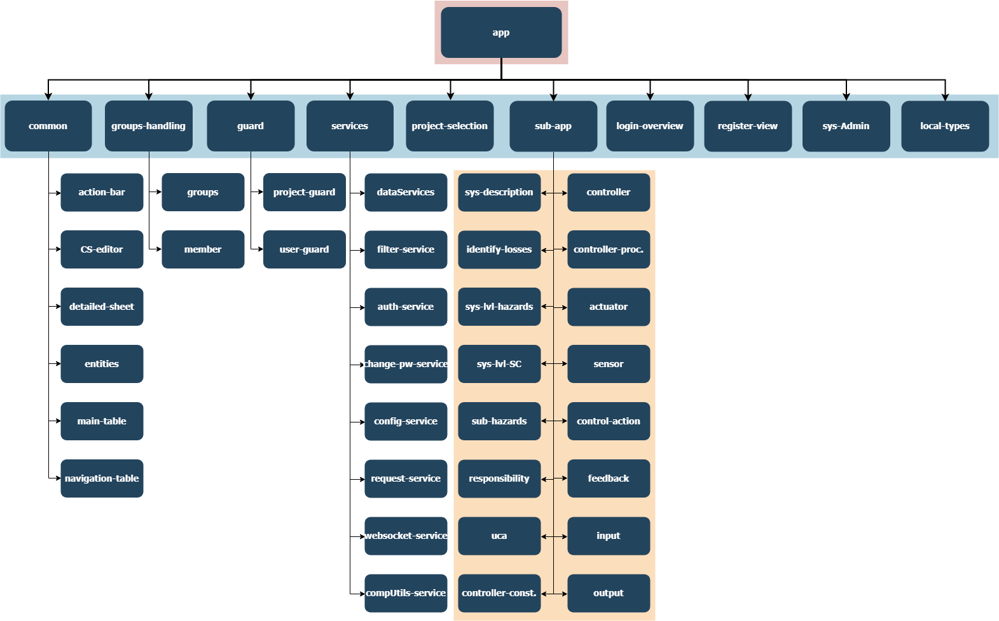

XSTAMPP 4.0 System Composition
==============================

:house:[Home](README.md)

Backend
-------
_TODO: Programmablaufdiagramm_

Frontend
--------
In the frontend all STPA-specific components are structured in the _sub-app module_. This module always contains the sidenavigation with hamburger menu and the toolbar. The main component varies over the STPA steps such as hazards, losses etc.

System-wide components such as project selection, system admin view, group and member handling, register and login view are separate components with their own toolbar and action bar implemented.

Figure 1: System Composition Frontend/Folder structure

## sub-app 
all componets inside the have the `Side_Navigation` and the `Toolbar`. The remaining height of the components inside the sub-app are set by the css with  height: calc(100vh - 64px) (64px is the height of the `Toolbar`).

## sys-Admin, project-selection, group-handling
 have their own `Toolbar`. Currently the `Toolbar` is not implemented as a reusable component.

## common 
in common are all reusable system-components which are explained in detail in the component-catalog.md

## services
Service | Describtion | 
--------| --------    |
dataServices  | contains the different predefined API calls to create/edit/... entities of STPA   | 
filterService | currently used as a EmitterService class for all types of emitters, which are used for communication between two different/unrelated components 
 `ClearSelectionEmitter` is used to emit to `main-table` that all selected checboxes should be cleared e.g. if view is switched/closed else the `main-table` will assume that the checkboxes are still selected. (Used by all components which have a `main-table`, subscriber is `main-table`)
 
`AdvancedFilterEmitter` is used to pass data to the `action-bar` so that the `action-bar` is able to display the data as "filter chips" (Used by UCA component, subscriber is `action-bar`
 
`DeleteRequestEmitter` is used to emit the "delete event" if the delete symbol "rubbish bin" is clicked and the delete-dialog accepted, the signal is emitted to the `main-table` which will handle find all selected items (Used by `action-bar`, subscriber is `main-table`) 
 
 `DeleteResponseEmitter` is used to emit all the selected elements inside the `main-table` to the `action-bar` when a `DeleteRequestEmitter` notifies the `main-table` (Used by `main-table`, subscriber is `action-bar`) 
 
 `SelectedEntryExist` is used to emit to the `action-bar` if a checkbox is selected (main purpose of this is to disable delete symbol "rubbish bin" if no element was selected) (Used by `main-table`, subscriber is `action-bar`).

`FilterEmitter` is used to emit the entered string inside the "filter input" of the `action-bar` to the `main-table` for filtering. (Used by `action-bar`, subscriber is `main-table`) 
 |
|auth-service| containts predefined API calls to fetch the UserToken, ProjectToken and some Methods to retrieve user related data from the UserToken| 
|change-pw-service| contains emitter for the password-change dialog from the Sys-admin view |
|config-service| contains global informations e.g. IP-address of the server |
|request-service| contains predefined POST,PUT,GET,DELETE http constructs which are customized to projecttoken, usertoken logic |
|websocket-service| contains the implementation of the websocket connection to the server |
|compUtils-service| meant for extracting of complicated functions from components |
